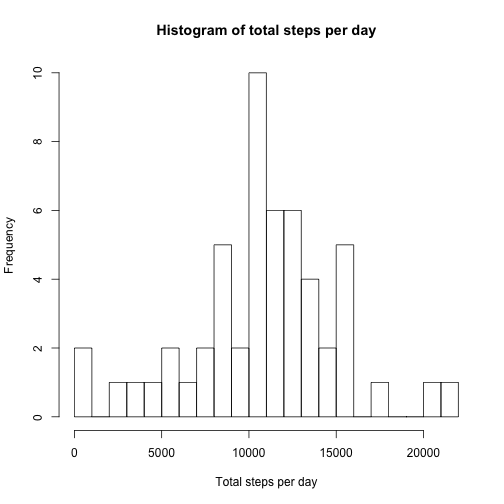
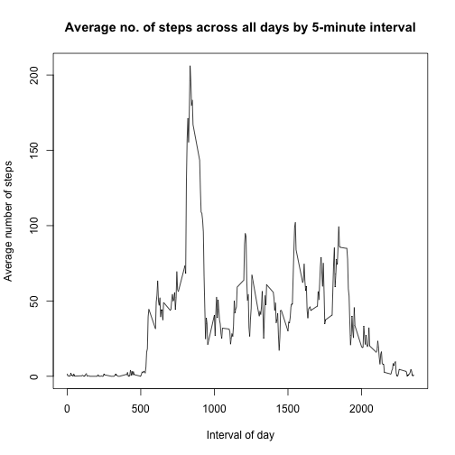
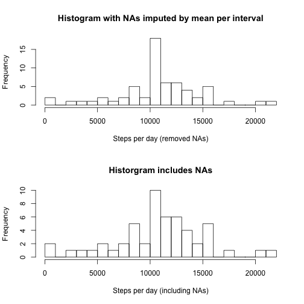
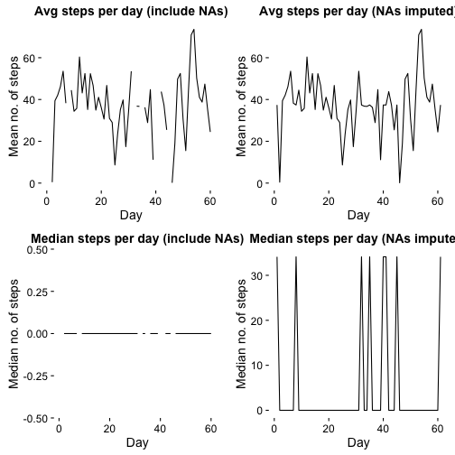
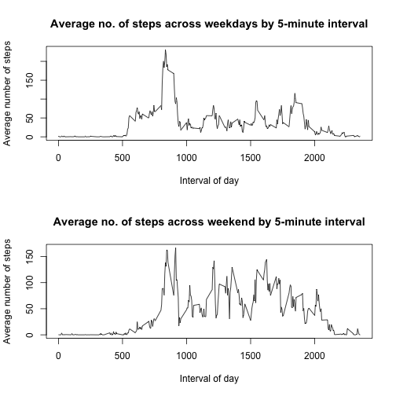

title: "Reproducible Research: Peer Assessment 1"
output: 
  html_document:
    keep_md: true

## Loading and preprocessing the data


```r
unzip("activity.zip") 
act <- read.csv("activity.csv") 
str(act)
```

```
## 'data.frame':	17568 obs. of  3 variables:
##  $ steps   : int  NA NA NA NA NA NA NA NA NA NA ...
##  $ date    : Factor w/ 61 levels "2012-10-01","2012-10-02",..: 1 1 1 1 1 1 1 1 1 1 ...
##  $ interval: int  0 5 10 15 20 25 30 35 40 45 ...
```

```r
summary(act)
```

```
##      steps                date          interval     
##  Min.   :  0.00   2012-10-01:  288   Min.   :   0.0  
##  1st Qu.:  0.00   2012-10-02:  288   1st Qu.: 588.8  
##  Median :  0.00   2012-10-03:  288   Median :1177.5  
##  Mean   : 37.38   2012-10-04:  288   Mean   :1177.5  
##  3rd Qu.: 12.00   2012-10-05:  288   3rd Qu.:1766.2  
##  Max.   :806.00   2012-10-06:  288   Max.   :2355.0  
##  NA's   :2304     (Other)   :15840
```


## What is mean total number of steps taken per day?


```r
# calculate total, mean and median steps by date
library(dplyr)
steps_per_day <- act %>%
        group_by(date) %>%
        summarize(total_steps = sum(steps), 
                  mean_steps = mean(steps, na.rm = TRUE),
                  med_steps = median(steps, na.rm = TRUE)
        ) 

steps_per_day$mean_steps 
```

```
##  [1]        NaN  0.4375000 39.4166667 42.0694444 46.1597222 53.5416667
##  [7] 38.2465278        NaN 44.4826389 34.3750000 35.7777778 60.3541667
## [13] 43.1458333 52.4236111 35.2048611 52.3750000 46.7083333 34.9166667
## [19] 41.0729167 36.0937500 30.6284722 46.7361111 30.9652778 29.0104167
## [25]  8.6527778 23.5347222 35.1354167 39.7847222 17.4236111 34.0937500
## [31] 53.5208333        NaN 36.8055556 36.7048611        NaN 36.2465278
## [37] 28.9375000 44.7326389 11.1770833        NaN        NaN 43.7777778
## [43] 37.3784722 25.4722222        NaN  0.1423611 18.8923611 49.7881944
## [49] 52.4652778 30.6979167 15.5277778 44.3993056 70.9270833 73.5902778
## [55] 50.2708333 41.0902778 38.7569444 47.3819444 35.3576389 24.4687500
## [61]        NaN
```

Make a histogram of the total number of steps taken each day


```r
hist(steps_per_day$total_steps, breaks = 20,
     xlab = "Total steps per day", main = "Histogram of total steps per day")
```



Report the mean and median of the total number of steps taken per day


```r
steps_per_day$mean_steps
```

```
##  [1]        NaN  0.4375000 39.4166667 42.0694444 46.1597222 53.5416667
##  [7] 38.2465278        NaN 44.4826389 34.3750000 35.7777778 60.3541667
## [13] 43.1458333 52.4236111 35.2048611 52.3750000 46.7083333 34.9166667
## [19] 41.0729167 36.0937500 30.6284722 46.7361111 30.9652778 29.0104167
## [25]  8.6527778 23.5347222 35.1354167 39.7847222 17.4236111 34.0937500
## [31] 53.5208333        NaN 36.8055556 36.7048611        NaN 36.2465278
## [37] 28.9375000 44.7326389 11.1770833        NaN        NaN 43.7777778
## [43] 37.3784722 25.4722222        NaN  0.1423611 18.8923611 49.7881944
## [49] 52.4652778 30.6979167 15.5277778 44.3993056 70.9270833 73.5902778
## [55] 50.2708333 41.0902778 38.7569444 47.3819444 35.3576389 24.4687500
## [61]        NaN
```

```r
steps_per_day$med_steps
```

```
##  [1] NA  0  0  0  0  0  0 NA  0  0  0  0  0  0  0  0  0  0  0  0  0  0  0
## [24]  0  0  0  0  0  0  0  0 NA  0  0 NA  0  0  0  0 NA NA  0  0  0 NA  0
## [47]  0  0  0  0  0  0  0  0  0  0  0  0  0  0 NA
```


## What is the average daily activity pattern?


```r
by_interval <- act %>%
        group_by(interval) %>%
        summarise(mn_stp = mean(steps, na.rm = TRUE)) # calculate mean steps for each interval

with(by_interval, plot(interval, mn_stp, type = "l", 
                       ylab = "Average number of steps",
                       xlab = "Interval of day", 
                       main = "Average no. of steps across all days by 5-minute interval"))
```



Which 5-minute interval, on average across all the days in the dataset, contains the maximum number of steps?


```r
which.max(by_interval$mn_stp)
```

```
## [1] 104
```

## Imputing missing values


```r
sum(is.na(act))
```

```
## [1] 2304
```

Fill in all of the missing values in the dataset with the mean for that 5-minute interval.


```r
mn_int <- tapply(act$steps, act$interval, mean, na.rm = TRUE) # calculation of mean steps per interval
act$step.narm <- replace(act$steps, is.na(act$steps), mn_int) # new "steps" variable in data set with NA values replaced by the mean at each interval
```

Make a histogram of the total number of steps taken each day with the imputed values


```r
steps_per_day_narm <- act %>%
  group_by(date) %>%
  summarize(total_steps = sum(step.narm),
            mean_steps = mean(step.narm),
            med_steps = median(step.narm)
  ) ## calculate total, mean and median steps per day with imputed NA values

par(mfrow = c(2, 1)) ## make plots side by side for comparison
hist(steps_per_day_narm$total_steps, breaks = 20, 
     xlab = "Steps per day (removed NAs)",
     main = "Histogram with NAs imputed by mean per interval")
hist(steps_per_day$total_steps, breaks = 20,
     xlab = "Steps per day (including NAs)",
     main = "Historgram includes NAs")
```



Recalculate and report the mean and median total number of steps taken per day.


```r
steps_per_day_narm$mean_steps
```

```
##  [1] 37.3825996  0.4375000 39.4166667 42.0694444 46.1597222 53.5416667
##  [7] 38.2465278 37.3825996 44.4826389 34.3750000 35.7777778 60.3541667
## [13] 43.1458333 52.4236111 35.2048611 52.3750000 46.7083333 34.9166667
## [19] 41.0729167 36.0937500 30.6284722 46.7361111 30.9652778 29.0104167
## [25]  8.6527778 23.5347222 35.1354167 39.7847222 17.4236111 34.0937500
## [31] 53.5208333 37.3825996 36.8055556 36.7048611 37.3825996 36.2465278
## [37] 28.9375000 44.7326389 11.1770833 37.3825996 37.3825996 43.7777778
## [43] 37.3784722 25.4722222 37.3825996  0.1423611 18.8923611 49.7881944
## [49] 52.4652778 30.6979167 15.5277778 44.3993056 70.9270833 73.5902778
## [55] 50.2708333 41.0902778 38.7569444 47.3819444 35.3576389 24.4687500
## [61] 37.3825996
```

```r
steps_per_day_narm$med_steps
```

```
##  [1] 34.11321  0.00000  0.00000  0.00000  0.00000  0.00000  0.00000
##  [8] 34.11321  0.00000  0.00000  0.00000  0.00000  0.00000  0.00000
## [15]  0.00000  0.00000  0.00000  0.00000  0.00000  0.00000  0.00000
## [22]  0.00000  0.00000  0.00000  0.00000  0.00000  0.00000  0.00000
## [29]  0.00000  0.00000  0.00000 34.11321  0.00000  0.00000 34.11321
## [36]  0.00000  0.00000  0.00000  0.00000 34.11321 34.11321  0.00000
## [43]  0.00000  0.00000 34.11321  0.00000  0.00000  0.00000  0.00000
## [50]  0.00000  0.00000  0.00000  0.00000  0.00000  0.00000  0.00000
## [57]  0.00000  0.00000  0.00000  0.00000 34.11321
```

Do these values differ from the estimates from the first part of the assignment? 


```r
summary(steps_per_day$mean_steps)
```

```
##    Min. 1st Qu.  Median    Mean 3rd Qu.    Max.    NA's 
##  0.1424 30.7000 37.3800 37.3800 46.1600 73.5900       8
```

```r
summary(steps_per_day_narm$mean_steps)
```

```
##    Min. 1st Qu.  Median    Mean 3rd Qu.    Max. 
##  0.1424 34.0900 37.3800 37.3800 44.4800 73.5900
```

```r
summary(steps_per_day$med_steps)
```

```
##    Min. 1st Qu.  Median    Mean 3rd Qu.    Max.    NA's 
##       0       0       0       0       0       0       8
```

```r
summary(steps_per_day_narm$med_steps)
```

```
##    Min. 1st Qu.  Median    Mean 3rd Qu.    Max. 
##   0.000   0.000   0.000   4.474   0.000  34.110
```

```r
## make figures for comparison
library(ggplot2)
library(cowplot)
p1 <- ggplot(steps_per_day, aes(as.numeric(date), mean_steps)) +
    geom_line() +
    labs(x = "Day", y = "Mean no. of steps", title = "Avg steps per day (include NAs)")

p2 <- ggplot(steps_per_day_narm, aes(as.numeric(date), mean_steps)) +
    geom_line() + 
    labs(x = "Day", y = "Mean no. of steps", title = "Avg steps per day (NAs imputed)")

p3 <- ggplot(steps_per_day, aes(as.numeric(date), med_steps)) +
    geom_line() +
    labs(x = "Day", y = "Median no. of steps", title = "Median steps per day (include NAs)")

p4 <- ggplot(steps_per_day_narm, aes(as.numeric(date), med_steps)) +
    geom_line() +
    labs(x = "Day", y = "Median no. of steps", title = "Median steps per day (NAs imputed)")

plot_grid(p1, p2, p3, p4, ncol = 2)
```

```
## Warning: Removed 2 rows containing missing values (geom_path).

## Warning: Removed 2 rows containing missing values (geom_path).
```



## Are there differences in activity patterns between weekdays and weekends?


```r
library(timeDate)
act$date <- as.Date(act$date)  # convert date variable to data format
act$day <- weekdays(act$date) # create day variable

#subset data and add variable for weekend/weekday
wkends <- act %>%
  filter(day == "Sunday"| day == "Saturday") %>%
  mutate(wkday = "weekend")

wkdys <- act %>%
  filter(day == "Monday"| day == "Tuesday" | day == "Wednesday" | 
           day == "Thursday" | day == "Friday") %>%
  mutate(wkday = "weekday")

all_dat <- bind_rows(wkends, wkdys) %>%
        arrange(date) ## new data set with weekend and weekday
```

Panel plot containing a time series plot (i.e. type = "l") of the 5-minute interval and the average number of steps taken, averaged across all weekday days or weekend days.


```r
# calculate mean steps for weekday
by_int_wkdy <- wkdys %>%
  group_by(interval) %>%
  summarise(mn_stp = mean(step.narm)) 

# calculate mean steps for weekend
by_int_wkend <- wkends %>%
  group_by(interval) %>%
  summarise(mn_stp = mean(step.narm)) 

par(mfrow = c(2, 1))

with(by_int_wkdy, plot(interval, mn_stp, type = "l", 
                       ylab = "Average number of steps",
                       xlab = "Interval of day", 
                       main = "Average no. of steps across weekdays by 5-minute interval"))
with(by_int_wkend, plot(interval, mn_stp, type = "l", 
                       ylab = "Average number of steps",
                       xlab = "Interval of day", 
                       main = "Average no. of steps across weekend by 5-minute interval"))
```



